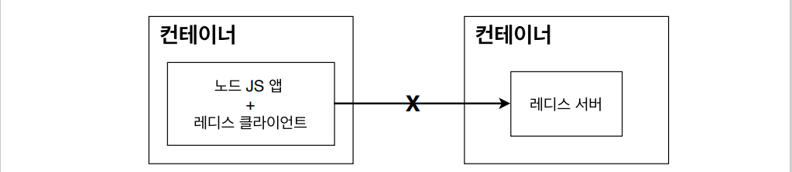
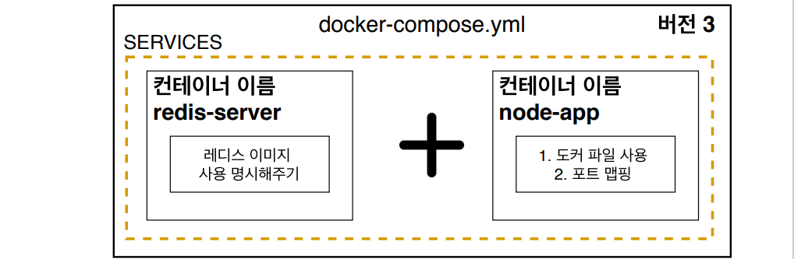

# Docker CI [3]


## 1. docker-compose

- 다중 컨테이너 도커 어플리케이션을 정의하고 실행하기 위한 도구

- 컨테이너가 여러개 동작해서 app이 작동해야하는 경우?

  => 각각의 컨테이너들이 통신할 방법이 필요함

  

- 간단한 앱 만들기(redis + nodejs)

- redis?
  == remote dictionary server 는 메모리 기반의 키-값 구조
  데이터 관리시스템, 모든 데이터를 메모리에 저장하고 빠르게 조회할 수 있는 비관계형 데이터베이스임(NoSql)

- nodejs + redis 로 만든 앱을 docker로 올리면

- 

- 먼저 redis 서버가 작동하고 있어야함(전제)

  이후에 nodejs앱 + redis 클라이언트가 한 컨테이너에서 작동

  하지만 에러가 발생한다.

  => 이유는 컨테이너 사이에서 아무런 설정없이 통신할 수 없기 때문에
  => nodejs 앱에서 redis 서버에 접근 할 수 없다.

- 

- 통신을하기 위해 docker-compose.yml 파일 작성

  컨테이너 사이에서 통신 설정을 해주기 위해서는 (멀티 컨테이너 상황)

- 

- docker-compose.yml

  ```yaml
  version: "3"	# 버전
  services:		# 이곳 하위에 실행하려는 컨테이너들을 정의
    redis-server:	# 컨테이너 이름
      image: "redis"	# 컨테이너에 사용하는 이미지(docker hub에서 가져옴)
    node-app:		# 컨테이너 이름
      build: .		# docker hub이 아닌 Dockerfile를 사용
      ports:
        - "5000:8080"	# port 매핑 로컬port : 컨테이너 port
  ```

- docker-compose 명령어

  ```shell
  docker-compose up 
  # => 실행
  docker-compose up -d
  # => 백그라운드로 실행
  docker-compose up --build
  # => 다시 build 하고 실행
  docker-compose up -d --build
  # => 백그라운드로 다시 build하고 실행
  docker-compose down 
  # => 컨테이너 멈추기
  docker-compose down
  # => 멈추기
  ```

  

