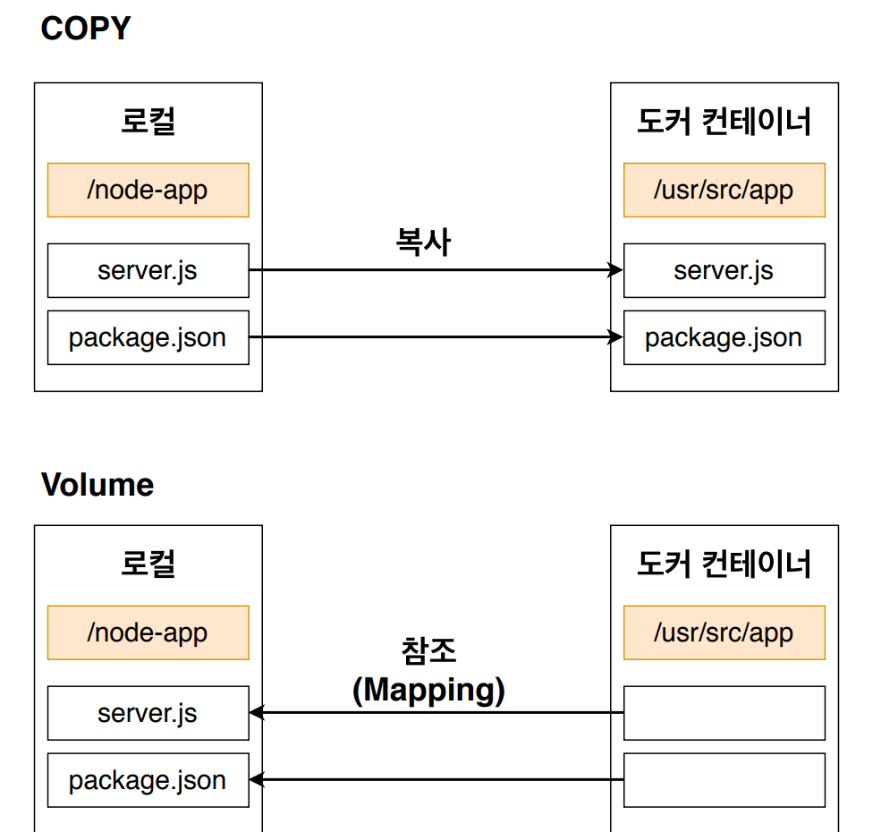

FROM node:10

RUN npm install

CMD ["node", "server.js"]Docker CI [2]


## 1. 간단한 App을 만들기

- App

```js
// server.js

const express = require("express");

const PORT = 8080;

// APP
const app = express();
app.get("/", (req, res) => {
  res.send("Hello World");
});

// APP 실행방법(8080 == PORT으로 접속하면됨)
app.listen(PORT);
```


- Dockerfile(v1)

```dockerfile
FROM node:10

RUN npm install

CMD ["node", "server.js"]
```

- 여기에서는 package.json이 없다고 에러가 발생함
  => npm install에서 dependencies를 받아와야하는데 해당 스냅샷 안에는 package.json이 없음
  => COPY를 통해서 복사해 와야함
- COPY package.json(로컬에 있는 이 파일을) ./(도커 컨테이너의 이 지정된 장소에 복사해주기)
  == COPY 복사할 파일 경로 컨테이너내에서 파일이 복사될 경로
- 그리고 실행을 하면?
-  => server.js가 없다고 에러가 발생함 : 원인은 위와 같음
  => COPY를 전부 복사함
  => COPY ./ ./


- Dockerfile(v2)

```dockerfile
FROM node:10

COPY ./ ./

RUN npm install

CMD ["node", "server.js"]
```

- => docker build -t ghlim909/nodejs ./ 
  => docker run ghlim909/nodejs:latest

  => 또 에러가 발생함 포트때문

- server.js에 PORT를 8080으로 설정했지만 localhost PORT에서는 접근할 방법이 없다...
  => docker run -p 5000:8080 ghlim909/nodejs
  => docker run -p [localhost의 PORT]:[container의 PORT] [이미지 이름]


- WORKDIR 설정하기
  - WORKDIR을 설정하지 않으면 Dockerfile의 COPY를 통해 복사되는 파일들이 컨테이너의 root 디렉토리에 복사된다
    이렇게 되면 단점은
    => 1. root 디렉토리가 매우 더러워짐
    => 2. 만약에 로컬에 있는 폴더명이 root디렉토리의 기본설정 폴더명과 같으면 덮어 써버림 ;;
    => WORKDIR를 설정해서 COPY 되는 파일들을 특정 디렉토리안에 넣어버리면된다


- Dockerfile(v3)

```dockerfile
FROM node:10

WORKDIR /usr/src/app

COPY ./ ./

RUN npm install

CMD ["node", "server.js"]
```

- => WORKDIR /usr/src/app 를 통해 /usr/src/app안에 COPY된 파일들을 넣는다
  => docker run -it ghlim909/nodejs sh 
  => 를 통해 해당 컨테이너 내부로 들어가면 바로 로컬에서 COPY된 목록들부터 볼 수 있다.


- -d 옵션
  => 컨테이너를 백그라운드로 실행하는 옵션


- 그렇다면 만약에 소스코드가 바뀌었을 경우에 이를 웹사이트에 반영하기 위해서는?
  => 다시 도커파일로 도커이미지를 빌드 

  => 도커 이미지로 컨테이너를 생성 후 앱 실행
  => 위의 과정을 반복해야함
  => why?
  => COPY ./ ./를 사용했기 때문에 소스가 바뀐 부분은 server.js뿐이지만 모든 node module까지 다시 다운 받아야함
  => 그리고 소스 하나 변경했을 뿐이지만 이미지를 다시 생성하고 다시 컨테이너를 실행시켜줘야함
  => 매우 비효율적임


- Dockerfile(v4)

```dockerfile
FROM node:10

WORKDIR /usr/src/app

COPY package.json ./		=> package.json을 맨 처음에는 먼저 복사를 하고 npm install 해놓고 이후에 소스코드가 변경되면 이 부분은 캐시 이용

RUN npm install

COPY ./ ./

CMD ["node", "server.js"]
```


- 맥에서

  -v $(pwd):/usr/src/app

  윈도우에서

  -v %cd%:/usr/src/app


- VOLUME 옵션
- COPY는 로컬의 파일을 컨테이너에 복사하지만 
  VOLUME은 컨테이너가 로컬의 파일을 참조함
- 

- VOLUME을 사용해서 파일목록을 mapping하면 이후에 소스코드가 바뀌어도 이미지를 다시 빌드하지 않고 컨테이너만  stop했다가 run해서 변경된 코드 적용 가능

- ```shell
  docker run -p 5000:8080 -v /usr/src/app/node_modules -v %cd%:/usr/src/app [이미지 아이디]
  # docker run -p [local PORT]:[container PORT] -v [참조하지 않을 특정 WORKDIR 파일] -v [참조할 local dir]:[컨테이너의 WORKDIR] [이미지 아이디]
  ```

  - -v /usr/src/app/node_modules => local에는 node_modules가 없기 때문에 WORKDIR의 node_modules는 local을 참조하지 않겠다.
  - -v %cd%:/usr/src/app => %cd%는 참조할 local의 디렉토리 주소, /usr/src/app은 컨테이너의 WORKDIR 주소