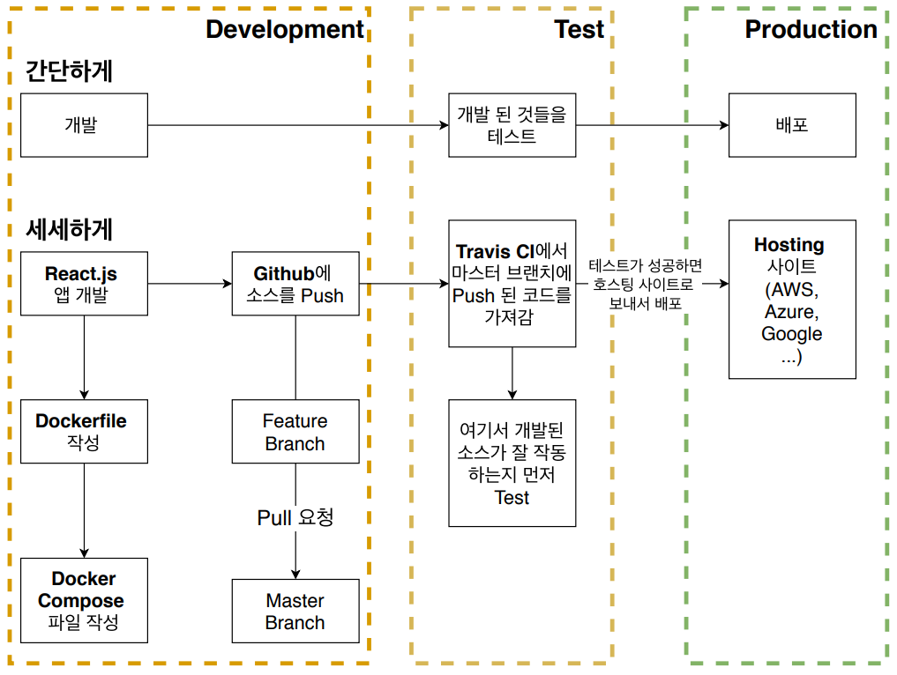
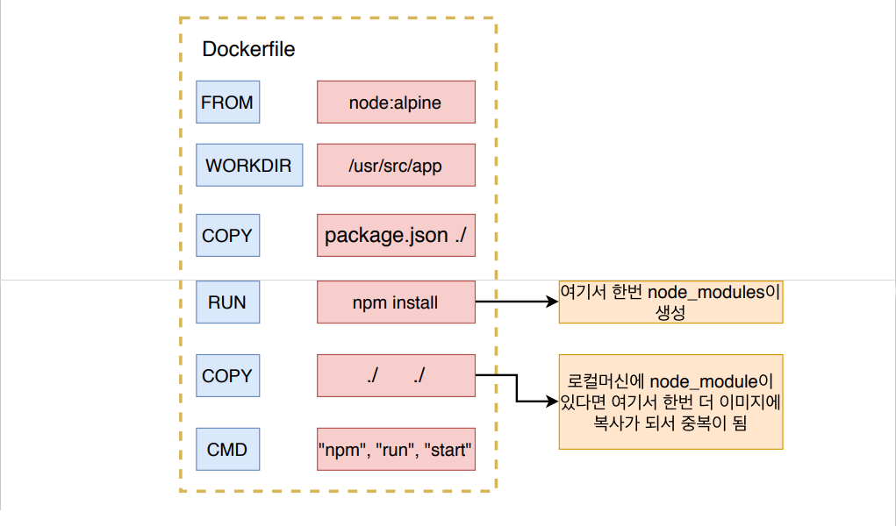
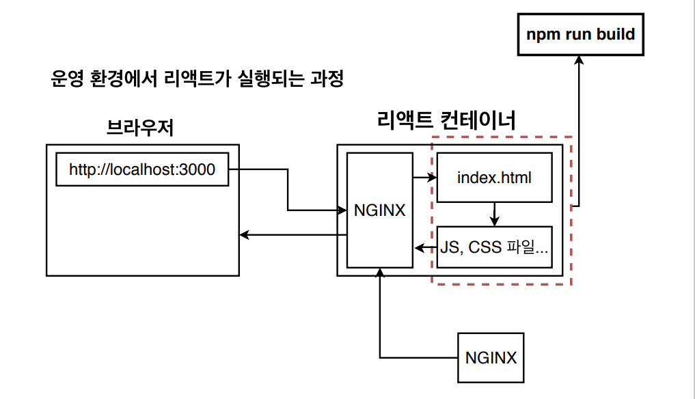
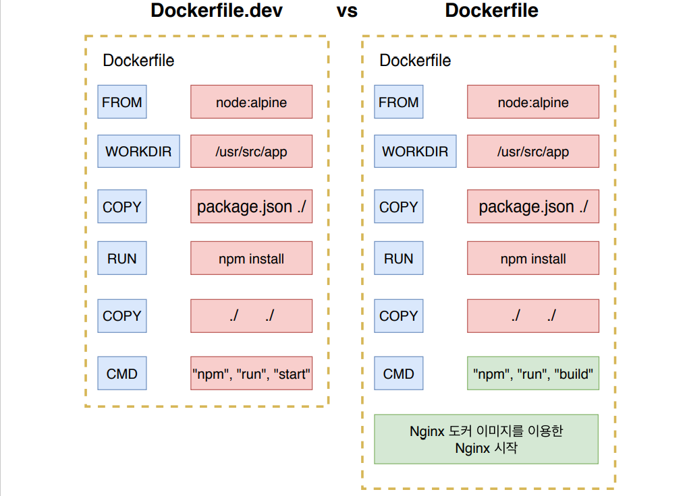
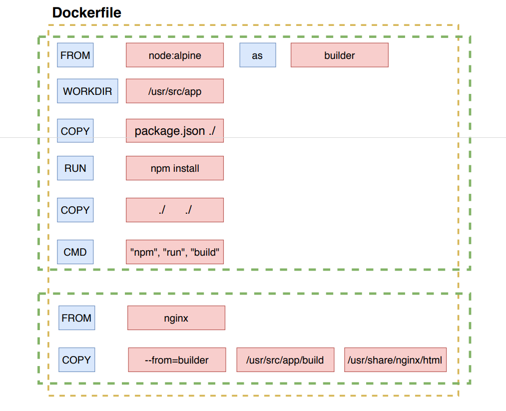

# Docker CI [4]


## 1. Flow




## 2. 간단한 앱 만들기

- React

- react 명령어

  ```shell
  # 리액트 설치
  npx create-react-app ./
  
  # 리액트 실행
  npm run start
  # 리액트 테스트
  npm run test
  # 리액트 배포
  npm run build
  ```

- react의 Dockerfile

  ```dockerfile
  FROM node:alpine
  
  WORKDIR /usr/src/app
  
  COPY package.json ./
  
  RUN npm install
  
  COPY ./ ./
  
  CMD ["npm", "run", "start"]
  ```

- Dockerfile.dev가 작성된 이후에
  docker build ./ 하면 Dockerfile을 찾지 못했다는 에러가 발생
  => docker build -f Dockerfile.dev ./
  => -f 옵션으로 직접 Dockerfile이름을 지정해줌

- node_modules 삭제 

  

- 포트 설정 + -it 옵션을 한 후 에 run!

- [react 앱을 docker로 실행하기]

  - 위에서 만든 react Dockerfile.dev를 가지고 이미지 만들기
    => docker build -f Dockerfile.dev -t ghlim909/docker-react-app ./

  - 만든 이미지로 컨테이너 만들기
    => docker run -it -p 3000:3000 ghlim909/docker-react-app

- VOLUME 옵션
  소스코드에서 변경이 되었을 경우 다시 이미지를 빌드하지 않고 VOLUME를 통해 변경한 부분을 적용하기

  ```shell
  docker run -it -p 3000:3000 -v /usr/src/app/node_modules -v $(pwd):/usr/src/app ghlim909/docker-react-app
  ```

- 하지만 위의 react Dockerfile의 디렉토리가 없거나 관리자 권한이 필요할 때 => Dockerfile 수정!

  ```dockerfile
  FROM node:alpine
  
  RUN cd home /
          && mkdir ret
  
  RUN chmod -R 777 /home/ret
  
  WORKDIR home/ret
  
  COPY package.json ./
  
  RUN npm install
  
  COPY ./ ./
  
  CMD ["npm", "run", "start"]
  ```

- 위의 run 실행 명령이 너무 길기 때문에 좀 더 간단한 방법 사용해보기
  => docker-compose.yml 이용

- docker-compose.yml 

  ```yaml
  version: "3"
  services:
    react:
      build:			# Dockerfile를 통해서 이미지를 만들고 빌드하는 경우에 작성
        context: .		# Dockerfile이 있는 위치
        dockerfile: Dockerfile.dev
      ports:
        - "3000:3000"
      volumes:
        - /usr/src/app/node_modules	# node_modules는 참조할 필요 없음을 알림 
        - ./:/usr/src/app		# -v $(pwd):/usr/src/app 과 같은 역할
      stdin_open: true		# react에서는 필수적으로 작성!
  ```

  - 이처럼 작성하고 => docker-compose up 하면 뒤에 Volume, Port 관련 설정 필요 X
  - react앱을 docker 에서 테스트하기
    npm run test를 docker 내부에서 하는법
    => docker run -it -p 3000:3000 ghlim909/docker-react-app npm run test


## 3. Nginx

- 

- 개발환경에서는 개발서버를 사용하지만 운영환경에서는 개발서버가 아닌 nginx를 사용한다.

- nginx를 사용하는 이유

  - nginx가 개발서버보다 불필요한 기능들이 없기 때문에 가볍다
  - nginx는 운영환경에 최적화되어 있기 때문에 빠르다. 

  => 따라서 운영환경에서는 nginx가 필요함

  => Dockerfile.dev와 운영용 Dockerfile을 따로 작성한다.

- 개발환경 Dockerfile VS 운영용 Dockerfile

  

- 운영용 Dockerfile은
  => react 빌드파일을 만드는 부분(builder stage) + nginx를 실행하는 부분(run stage) 로 구성

- (builder stage) 에서 생성된 파일들은 /usr/src/app/build 에 생성된다.

- 운영용 Dockerfile 구조

  

- nginx 와 연결하기 위해서는 /usr/share/nginx/html 에 연결

  => (builder stage)에서 생성한 빌드 파일들을 nginx의 /usr/share/nginx/html에 COPY한다
  => 이제, nginx가 외부에서 http요청이 들어올때마다 적절한 파일을 전달해줌

- Dockerfile

  ```dockerfile
  FROM node:alpine as builder	# FROM과 FROM사이에서는 builder로 부르겠음
  
  WORKDIR '/usr/src/app'
  
  COPY package.json ./
  
  RUN npm install
  
  COPY ./ ./
  
  RUN npm run build	# 이제 build니까! => 운영용!
  
  ############################################################
  
  FROM nginx		# nginx를 위한 베이스 이미지
  
  COPY --from=builder /usr/src/app/build /usr/share/nginx/html
  # FROM builder에서 가져옴 [빌드파일 위치] [nginx로 복사 위치(기본 위치임)]
  ```

  - => docker build -t [설정할 이미지 이름] . 으로 이미지 생성
    => 이미지가 생성된 후에 해당 이미지로 앱을 실행
    => docker run -p 8080:80 [이미지 이름] => nginx의 기본 포트번호는 80