# Docker CI [7] - Final


## 1. back + front + RDS + Travis CI + EB + docker hub

- AWS 배포 과정
  => github에 push 

  => master branch에 push가 되면 

  => Travis CI가 감지 후 테스트
  => 테스트가 성공하면 Dockerfile을 이용해서 Image를 생성(빌드) 후 Docker hub에 저장 

  => Docker Hub에서는 Travis CI에서 빌드된 이미지를 보관
  => AWS EB가 가져가려고 할 때 전달 

  => AWS EB에서 최종 배포 


- docker 환경의 mysql부분 정리
  이제부터는 개발환경이 아니라 운영환경이기 때문에 docker-compose.yml에서 mysql에 관한 사항이 필요 없다

  => AWS RDS에서 연결해야함
  => docker-compose.yml에서 mysql에 관한 내용은 전부 주석 처리


- 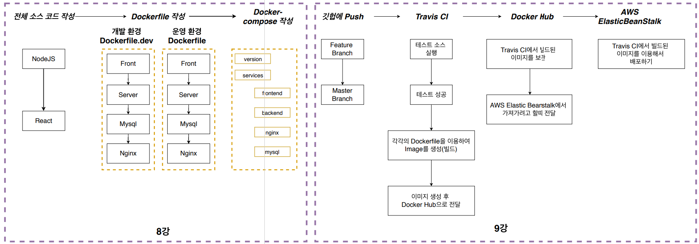


## 2. 최종 배포 하기

1. github에 push(master branch)

   - .gitignore를 통해서 불필요한 파일 ex) BE의 node_modules등을 추가하고 github에 push 한다.

2. Travis CI
   github에 push => Travis CI에서 자동으로 코드를 가져옴 => 테스트 진행 

   => 성공하면 해당 이미지들을 빌드
   => 빌드 된 이미지들을 docker hub에 보냄(docker hub에 빌드된 이미지를 보내고 AWS에서 그 이미지를 가져가므로 EB안에서 다시 빌드하지 않아도 된다!)

   => AWS EB에 docker hub에 이미지를 보냈다고 알림 

   => AWS EB에서 docker hub에 있는 이미지를 가져온 후에 배포

   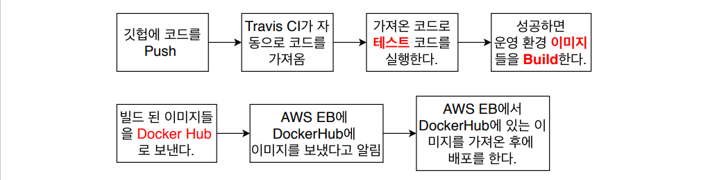

   - Travis CI에서 github에 있는 docker-fullstack-app을 활성화한다(이제 push event가 발생하면 Travis CI가 감지함)

3. .travis.yml 작성(테스트 성공시에 docker hub에 등록까지)

   ```yaml
   language: generic
   
   sudo: required
   
   services:
     - docker
   
   before_install:
     - docker build -t ghlim909/react-test-app -f ./frontend/Dockerfile.dev ./frontend
   
   script:
     - docker run -e CI=true ghlim909/react-test-app npm test
   
   after_success:	# test가 성공하면 docker hub에 내가 만든 이미지를 등록 
     - docker build -t ghlim909/docker-frontend ./frontend
     - docker build -t ghlim909/docker-backend ./backend
     - docker build -t ghlim909/docker-nginx ./nginx
   
     # Travis CI의 환경변수에 등록!
     - echo "$DOCKER_HUB_PASSWORD" | docker login -u "$DOCKER_HUB_ID" --password-stdin 
     
     # test 성공시 docker hub에 등록!
     - docker push ghlim909/docker-frontend
     - docker push ghlim909/docker-backend
     - docker push ghlim909/docker-nginx
   ```

   - docker hub에 로그인해서 repositories에 들어가보면 내가 push한 이미지들이 존재함

4. Dockerrun.aws.json작성
   Dockerrun.aws.json 파일(멀티 컨테이너 환경에서 사용) 

   => docker-compose.yml 로 바뀜
   기존에 EB에 배포한 파일에는 Dockerfile이 하나 밖에 없어서 EB가 알아서 배포했지만
   이제는 react, nginx, nodejs 등 여러개의 Dockerfile들이 존재하기 때문에 Dockerrun.aws.json 가 필요함

   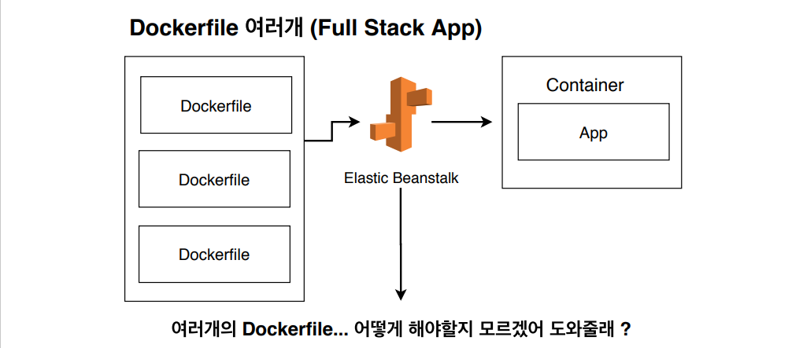

   Dockerrun.aws.json

   ```json
   {
     "AWSEBDockerrunVersion": 2,
     "containerDefinitions": [
       {
         "name": "frontend",
         "image": "ghlim909/docker-frontend", // docker hub에 올라간 이름
         "hostname": "frontend",
         "essential": false,
         "memory": 128
       },
       {
         "name": "backend",
         "image": "ghlim909/docker-backend",
         "hostname": "backend",
         "essential": false,
         "memory": 128
       },
       {
         "name": "nginx",
         "image": "ghlim909/docker-nginx",
         "hostname": "nginx",	// 다른 docker-compose에서 접근할 수 있도록 하는 host 이름임
         "essential": true,	// nginx는 멈추면 FE와 BE 모두 작동하지 않기 때문에 멈추면 all stop 명령 : true 
         "portMappings": [		// 외부와 컨테이너 포트를 연결 80:80 과 같음
           {
             "hostPort": 80,
             "containerPort": 80
           }
         ],
         "links": ["frontend", "backend"],	// nginx는 frontend와 backend 둘 다를 연결함
         "memory": 128
       }
     ]
   }
   ```

5. EB환경 설정(AWS EB 페이지)
   이전에 진행했던 방법과 동일함

   - 플랫폼은 Docker

   + Multi Container로 설정
   + Sample Application

6. VPC 와 Security group 설정

   - VPC 와 Security group를 왜 설정해야하는가?
     => EB와 RDS를 연결하기 위해!

   - VPC == Amazon Virtual Private Cloud
     VPC는 내가 AWS에서 만든 ec2, EB, RDS 등을 나의 아이디에서만 접근이 가능하게 논리적으로 격리된
     네트워크에서 생성이 되게 해주는 것(지역별로 다름 ap-northeast-2) 

   - Security group == 보안그룹(방화벽)
     Security group은 EB에 들어오는 트래픽(인바운드)과 나가는 트래픽(아웃바운드)을 컨트롤 해줌

   - 그렇다면 어떻게 VPC와 Security group를 통해서 EB와 RDS를 연결할까?
     먼저, 현재 EB와 RDS는 같은 VPC를 공유하고 있다(why? 내가 만들었으니까 ap-northeast-2공유)

     => 하지만 연결은 X

     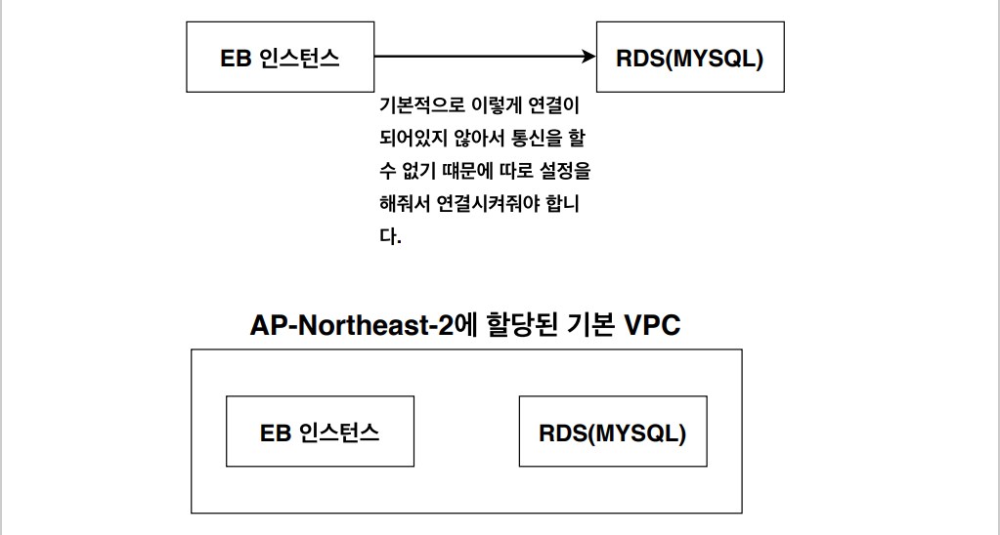

     => 해결방법 : Security group설정으로 같은 VPC를 가지는 것들 끼리는 전부 허용해주면 됨

     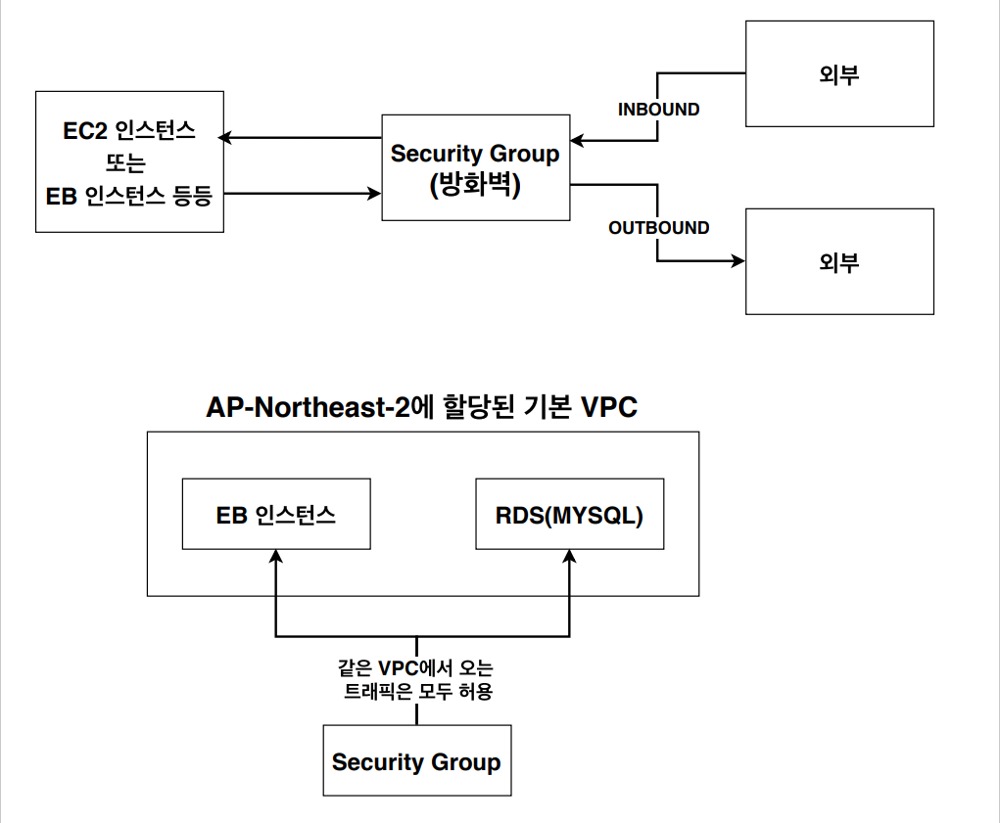

7. mysql을 위한 RDS 설정

   - docker-compose.yml에서 backend의 environment에 MYSQL관련 환경변수 설정

     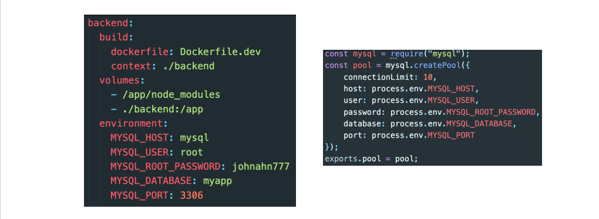

     - 기존의 mysql: 관련 설정들은 주석처리한다.

       => 이제 docker mysql이 아닌 외부 RDS를 사용하기 때문에

   - AWS에서 RDS 선택
     다양한 설정 옵션이 있음 

     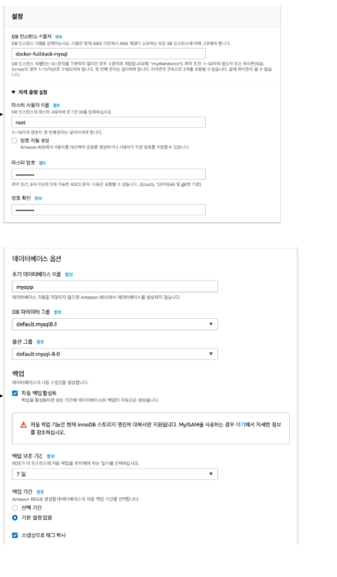

   - => docker-compose에서 설정한 MYSQL 환경변수만 맞춰주면 됨

8. Security group_1설정

   - VPC 생성 => 보안그룹 인바운드규칙에 3306 mysql 추가

     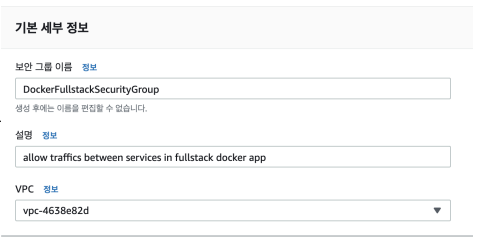

9. Security group_2 설정

   - 8번에서 생성한 보안그룹을 EB인스턴스와 RDS에 각각 적용해야한다.

     1. RDS에 적용

        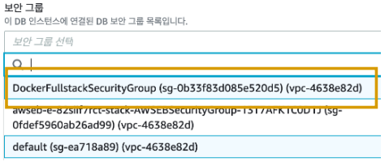

        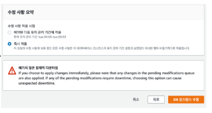

     2. 다음으로 EB에 적용

        1. EB검색 => 해당 환경이름 선택 => 구성 => 인스턴스 편집 => 새로 생성한 보안그룹추가 => 적용

   - => 이제 EB인스턴스와 RDS가 소통이 가능해짐

10.  EB와 RDS소통을 위한 환경 변수 설정 

    - EB인스턴스와 RDS가 소통이 가능해졌지만
      EB안에 있는 컨테이너들이 mysql 인스턴스와 소통할 때 환경변수를 인식하지 못함
      => AWS EB의 구성 

      => 소프트웨어 편집 

      => 환경변수 추가(docker-compose backend environment내용 - 이때 MYSQL_HOST만 RDS의 엔드포인트로 설정)

      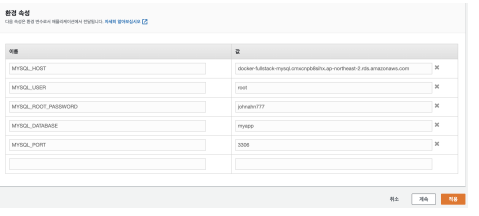

11.  .travis.yml에 배포부분 추가하기

    .travis.yml(deploy 설정까지 추가된 상태)

    ```yaml
    language: generic
    
    sudo: required
    
    services:
      - docker
    
    before_install:
      - docker build -t ghlim909/react-test-app -f ./frontend/Dockerfile.dev ./frontend
    
    script:
      - docker run -e CI=true ghlim909/react-test-app npm test
    
    after_success:
      - docker build -t ghlim909/docker-frontend ./frontend
      - docker build -t ghlim909/docker-backend ./backend
      - docker build -t ghlim909/docker-nginx ./nginx
    
      - echo "$DOCKER_HUB_PASSWORD" | docker login -u "$DOCKER_HUB_ID" --password-stdin
    
      - docker push ghlim909/docker-frontend
      - docker push ghlim909/docker-backend
      - docker push ghlim909/docker-nginx
    
    deploy:
      provider: elasticbeanstalk
    
      region: "ap-northeast-2"
      app: "docker-fullstack-app"						# 앱 이름
      env: "Dockerfullstackapp-env"						# 앱 환경 이름
      bucket_name: elasticbeanstalk-ap-northeast-2-xxx	# S3의 이름
      bucket_path: "docker-fullstack-app"				# 앱 이름과 똑같이 설정
      on:
        branch: master
    
      access_key_id: $AWS_ACCESS_KEY
      secret_access_key: $AWS_SECRET_ACCESS_KEY
    ```

12.  Travis CI의 AWS 접근을 위한 API key생성

    - 소스파일을 전달하기 위한 접근 조건

      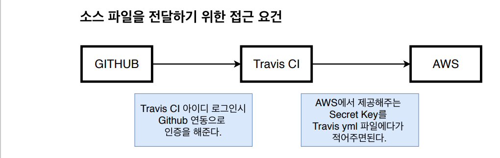

13.  AWS IAM 생성 후 .travis.yml파일의 환경변수에 최종 등록하기(위의 IAM과 같음)

    - 만들어진 key를 Travis CI에 저장해줘야함(환경변수에... DOCKER_HUB_ID 저장한 곳) => 저장된 키를 .travis.yml에서 가져와서 사용

      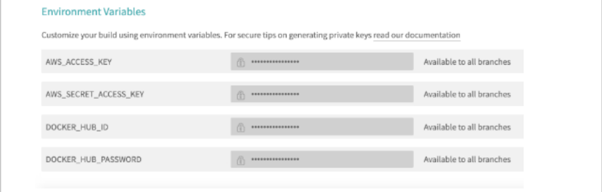

    - .travis.yml의 최종상태(Travis CI의 환경변수까지 적용된 상태)

      ```yaml
      language: generic
      
      sudo: required
      
      services:
        - docker
      
      before_install:
        - docker build -t ghlim909/react-test-app -f ./frontend/Dockerfile.dev ./frontend
      
      script:
        - docker run -e CI=true ghlim909/react-test-app npm test
      
      after_success:
        - docker build -t ghlim909/docker-frontend ./frontend
        - docker build -t ghlim909/docker-backend ./backend
        - docker build -t ghlim909/docker-nginx ./nginx
      
        - echo "$DOCKER_HUB_PASSWORD" | docker login -u "$DOCKER_HUB_ID" --password-stdin
      
        - docker push ghlim909/docker-frontend
        - docker push ghlim909/docker-backend
        - docker push ghlim909/docker-nginx
      
      deploy:
        provider: elasticbeanstalk
      
        region: "ap-northeast-2"
        app: "docker-fullstack-app"					
        env: "Dockerfullstackapp-env"				
        bucket_name: elasticbeanstalk-ap-northeast-2-xxx	
        bucket_path: "docker-fullstack-app"			
        on:
          branch: master
      
        access_key_id: $AWS_ACCESS_KEY				# IAM key저장
        secret_access_key: $AWS_SECRET_ACCESS_KEY		# IAM access key저장
      ```

      